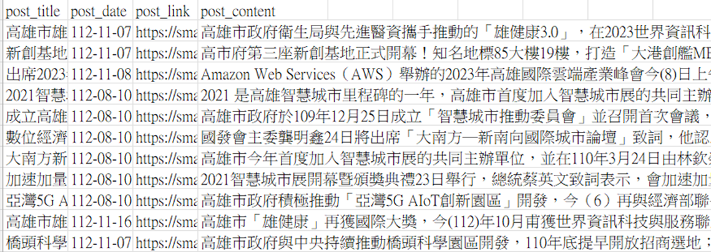

# Intern in Innolux

## Internproject_repair_parts

實習參與專案:物料資源最適化

內容：根據返品缺陷評估維修效益後，利用全球維修中心物料倉儲與使用紀錄建立模型滾動式預估三個月後所需用料，以降低物料倉儲成本。同時利用數據可視化各的用料異常情形，提高管理效率。

特色:完整參與決策分析類型專案與數據分析流程，學習跨部門溝通、合作、協調並從討論過程與資料層面幫助domain發現、釐清並解決問題，以數據提供決策建議。

## high_frequency_data_analysis
高頻資料分析：產線機器銑切數據分析

內容：高維度資料預處理、特徵工程、PCA與ARIMA建模結果評估。

特色：高維度資料擷取、資料預處理、領域知識、主成分分析、時間序列模型建模方式、建模結果評估

# Data analysis learning in master school

## air_pollution_analysis

中國五大城市PM2.5濃度分析：以時間、濕度、溫度..等氣候相關資料探討影響各城市PM2.5濃度的可能因素。

內容：以2013-2015之時間與氣候變數探討瀋陽、上海、成都、北京、廣州之PM2.5濃度，討論缺失值資料填補方法與必要性，並比較KNN與ARIMA建模結果。

特色：季節週期性資料、時間性資料、氣候資料、confounding variable、KNN Imputation、ARIMA

## time_series_data_analysis
運用大盤指數實踐時間序列分析流程。

## multivariate_analysis

LDA & EM algorithm:用程式實現LDA與EM演算法。

## physiological_signal_analysis

生理訊號資料分析

內容：根據量測儀器回傳之血壓與心率資料研究預測結果之校正方式，分析不同年齡層預測心率與血壓於演算法是否需要有差異性。

# Master's thesis

## crossover_design_for_count_data

碩士論文題目：個數資料於R(個序列)與C(個時間點)的交叉設計下之強
韌概似推論法

摘要：利用強韌化的獨立卜瓦松實作概似函數，分析 R 個序列與 C 個時間點
的交叉試驗設計下的個數型資料，以模擬研究與實例分析呈現強韌華德檢定統
計量 (robust wald statistics)、強韌分數檢定統計量 (robust score statistics)、強韌概似比檢定統計量 (robust likelihood ratio statistics)，在未知資料真實分配為何
的狀況下，仍可得到正確的統計推論。

# Python Crawler Learning

## scrapy-xpath

高雄市政府新聞標題、內文、發布時間與作者訊息擷取與重點摘錄自動化

內容：以scrapy框架爬取高雄市政府網站之市府新聞內容，模擬人為跳頁的方式自動收集網頁上所有新聞。並連接ChatGPT之API產生新聞重點摘錄回傳至MongoDB，以json形式儲存摘錄結果。
蒐集來源頁面上所有新聞連結後，進入每個連結蒐集標題、日期、內文，匯出結果包含新聞標題、日期、URL、內文。

